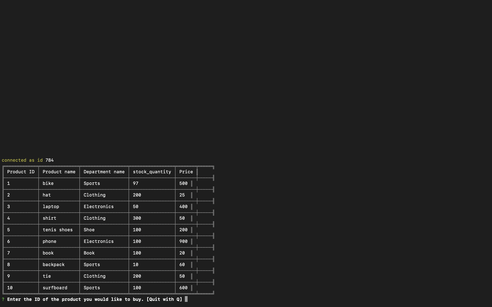

# bamazon

##### Bamazon is an app that simulater an online store. It shows a table with itens availeble. Each item has an unique id. The tabel also shows the name of the product, the departament the product is listed and quatity in stock. It takes an order verify if the product exists and if the quantity is availeble in stock. It updates the stock. And restarts the app. The user ca exit the store if the key "q" is pressed.

------
### Video Demo

---

## Technologies usen on the project
* Github
###### Github is a remote repository where we can store versions of our code.
* Gitlab
###### GitLab is a web-based DevOps lifecycle tool that provides a Git-repository manager providing wiki, issue-tracking and CI/CD pipeline features, using an open-source license, developed by GitLab Inc.

* JavaScript
###### JavaScript, often abbreviated as JS, is a high-level, interpreted scripting language that conforms to the ECMAScript specification. JavaScript has curly-bracket syntax, dynamic typing, prototype-based object-orientation, and first-class functions.

---
> Author
 Alexei Dias
 Linkedin 
 https://www.linkedin.com/in/alexei-dias-b4054a164/